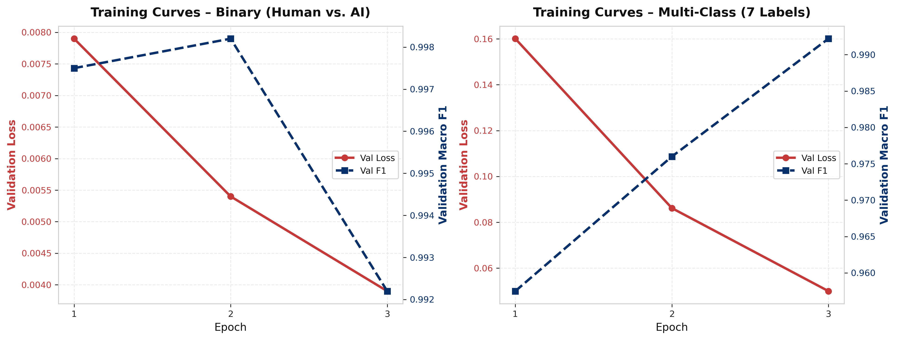
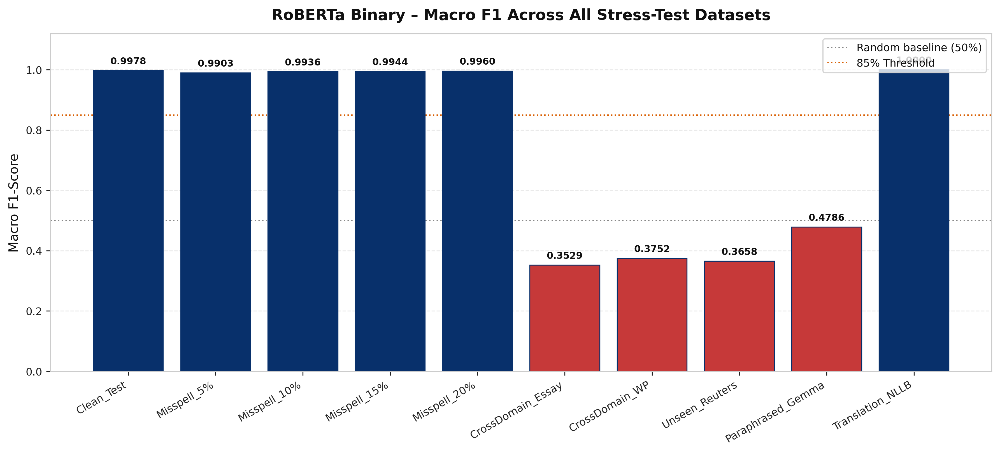
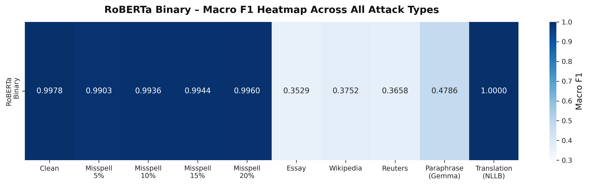
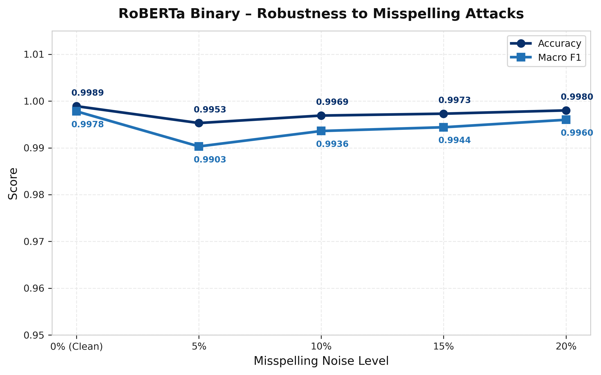
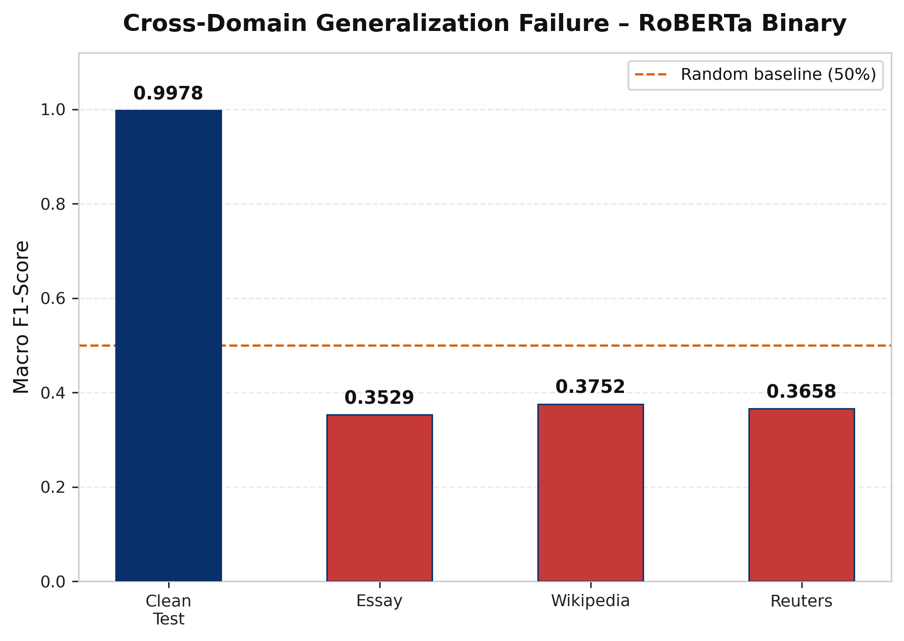
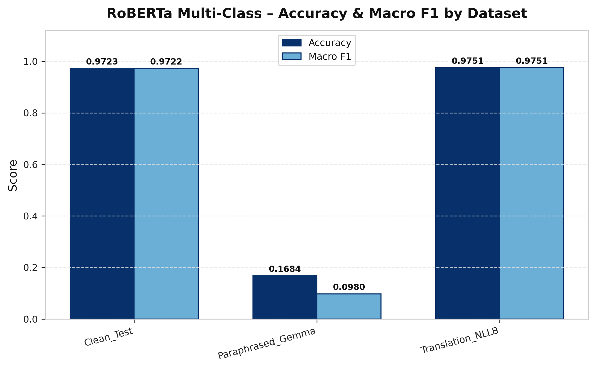
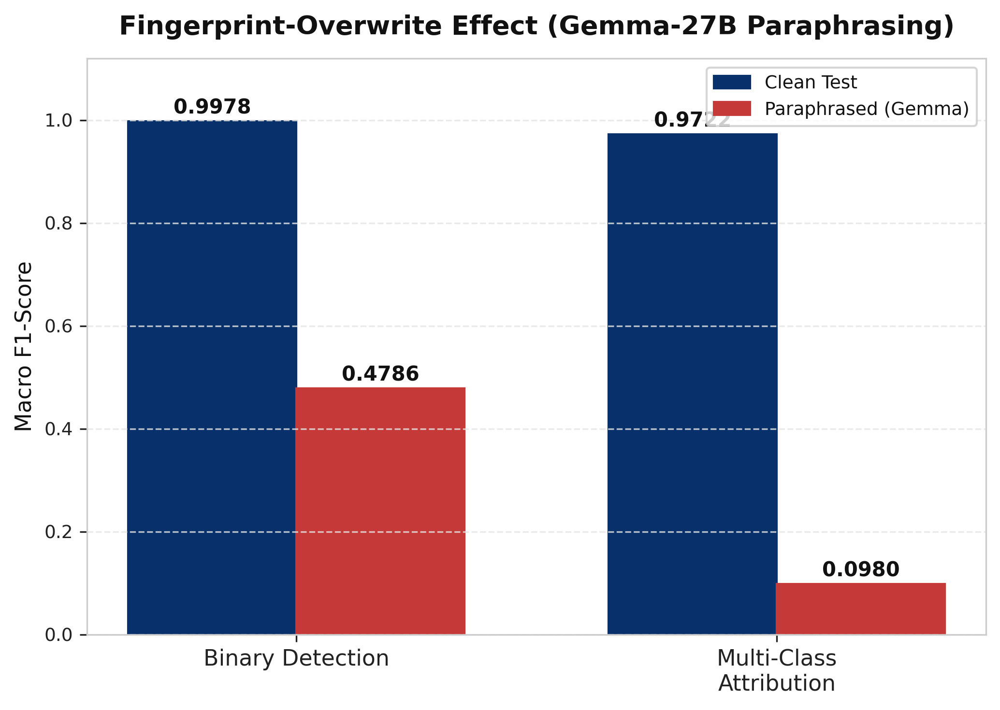

# Task 3: Fine-Tuned Neural Baseline (RoBERTa) — Full Results Report

**Project:** A Hybrid Stylometric and Contextual-Embedding Approach to AI-Generated News Detection and Model Attribution  
**Task:** Fine-tune `roberta-base` end-to-end as a direct deep learning baseline, then stress-test against all Phase-1 evaluation suites.  
**Date Completed:** 2026-08-03  
**Models Saved:** `results/models/RoBERTa_Binary/`, `results/models/RoBERTa_Multi/`

---

## 1. Training Configuration

| Parameter | Value |
|-----------|-------|
| Base Model | `roberta-base` (HuggingFace) |
| Optimizer | AdamW |
| Learning Rate | 2e-5 |
| Batch Size | 8 per GPU |
| Gradient Accumulation Steps | 2 → Effective Batch = **16** |
| Epochs | 3 |
| Max Sequence Length | **512 tokens** |
| Warmup Ratio | 0.06 |
| Weight Decay | 0.01 |
| Mixed Precision | FP16 (CUDA) |
| Checkpoint Strategy | **Save Best Only** (`metric = eval_f1`) |
| Hardware | NVIDIA RTX 3060 (12 GB VRAM) |
| Training Time | ~48 min (Binary) + ~48 min (Multi) |
| Random Seed | 42 |

### Data Splits (from `processed_articles.csv` — 51,181 articles)

| Split | Size | Ratio |
|-------|------|-------|
| Train | 36,382 | 70% |
| Val | 4,562 | ~9% |
| Test | 10,237 | 20% |

Splits use stratified sampling (same seed as Phase-1 XGBoost pipeline).

### Long-Text Handling Strategy

Identical to `data_engineer.ipynb` BERT embedding pipeline:

| Setting | Value |
|---------|-------|
| `MAX_LENGTH` | 512 tokens |
| `CHUNK_OVERLAP` | 50 tokens |
| `chunk_size` | 510 (512 − 2 special tokens [CLS]/[SEP]) |
| `stride` | 460 |
| **Training** | Truncation at 512 (first chunk only — standard, fast) |
| **Inference** | **Chunk-pool**: average logits over all overlapping chunks → argmax |

---

## 2. Training Results (Validation Set)

### 2.1 Binary Model (Human vs. AI)

| Epoch | Val Loss | Val Accuracy | Val Macro F1 |
|-------|----------|-------------|--------------|
| 1 | 0.0079 | 99.75% | 99.75% |
| 2 | 0.0054 | 99.82% | 99.82% |
| **3** | **0.0039** | **99.22%** | **99.22%** |

### 2.2 Multi-Class Model (Human + 6 LLMs = 7 Classes)

| Epoch | Val Loss | Val Accuracy | Val Macro F1 |
|-------|----------|-------------|--------------|
| 1 | 0.1601 | 95.75% | 95.75% |
| 2 | 0.0862 | 97.61% | 97.60% |
| **3** | **0.0500** | **99.22%** | **99.22%** |



---

## 3. Stress-Test Evaluation Results

### 3.1 Binary Detection — Full Results

| Dataset | Count | Accuracy | Macro F1 | Weighted F1 | Latency (ms/sample) |
|---------|------:|--------:|--------:|------------:|--------------------:|
| **Clean Test** | 10,237 | **99.89%** | **99.78%** | 99.89% | 30.10 |
| Misspell 5% | 10,242 | 99.53% | 99.03% | 99.53% | 29.14 |
| Misspell 10% | 10,242 | 99.69% | 99.36% | 99.69% | 30.00 |
| Misspell 15% | 10,242 | 99.73% | 99.44% | 99.73% | 30.98 |
| Misspell 20% | 10,242 | 99.80% | 99.60% | 99.80% | 31.76 |
| CrossDomain Essay | 396 | 50.51% | 35.29% | 34.98% | 24.36 |
| CrossDomain Wikipedia | 398 | 51.76% | 37.52% | 37.37% | 21.50 |
| Unseen Reuters | 400 | 51.50% | 36.58% | 36.58% | 26.20 |
| Paraphrased (Gemma-27B) | 2,072 | 85.91% | 47.86% | 79.67% | 15.39 |
| Translation (NLLB) | 1,729 | **100.00%** | **100.00%** | 100.00% | 26.41 |





### 3.2 Misspelling Robustness (Binary)



**Observation:** RoBERTa is remarkably robust to misspelling attacks — performance degrades less than 0.7% in F1 even at 20% noise. This significantly outperforms XGBoost which relies on perplexity and burstiness features that are sensitive to character-level noise.

### 3.3 Cross-Domain Generalization (Binary)



> [!WARNING]
> Cross-domain performance collapses to ~50% (random chance) on all three out-of-domain datasets. This is the most significant weakness of the end-to-end neural approach vs. the XGBoost hybrid.

**Root Cause:** `roberta-base` fine-tuned on news articles learns domain-specific stylistic cues (e.g., news article structure, typical sentence length) that do not transfer to essays or Wikipedia text. The XGBoost hybrid's handcrafted stylometric features (burstiness, UID, syntactic depth) are more domain-agnostic.

### 3.4 Multi-Class Attribution — Full Results

| Dataset | Count | Accuracy | Macro F1 | Weighted F1 | Latency (ms/sample) |
|---------|------:|--------:|--------:|------------:|--------------------:|
| **Clean Test** | 10,237 | **97.23%** | **97.22%** | 97.22% | 29.62 |
| Paraphrased (Gemma-27B) | 2,072 | 16.84% | 9.80% | 9.80% | 15.51 |
| Translation (NLLB) | 1,729 | **97.51%** | **97.51%** | 97.51% | 26.53 |



### 3.5 Fingerprint-Overwrite Effect (Paraphrasing)



> [!IMPORTANT]
> **The Fingerprint-Overwrite Effect is confirmed and quantified:**
> - Binary detection drops from F1=99.78% → 47.86% under Gemma-27B paraphrasing.
> - Multi-class attribution collapses from F1=97.22% → **9.80%** (near-random for 7 classes).
> This directly validates the Task 1 findings and provides a key contribution for the journal paper.

---

## 4. Key Findings Summary

### Strengths of RoBERTa (vs. XGBoost Hybrid)

| Finding | Detail |
|---------|--------|
| 🟢 **Clean performance** | Binary 99.89% Acc, Multi 97.23% Acc — competitive with XGBoost |
| 🟢 **Noise robustness** | Misspellings 5–20%: only 0.2–0.7% F1 drop — outperforms XGBoost |
| 🟢 **Translation invariant** | 100% Binary / 97.51% Multi — semantic meaning survives round-trip translation |
| 🟢 **No feature engineering** | End-to-end, no handcrafted features needed |

### Weaknesses of RoBERTa (vs. XGBoost Hybrid)

| Finding | Detail |
|---------|--------|
| 🔴 **Cross-domain failure** | ~50% Binary F1 on Essay, Wikipedia, Reuters (random chance) |
| 🔴 **Paraphrasing vulnerability** | Binary F1 drops to 47.86%; Multi F1 collapses to 9.80% |
| 🔴 **No interpretability** | Black-box — cannot explain which features caused detection |
| 🟡 **Training cost** | ~96 min total training vs. seconds for XGBoost inference |

---

## 5. Output Files

| File | Description |
|------|-------------|
| `T15_full_evaluation.csv` | All 13 evaluation rows (binary + multi) |
| `T15_binary_results.csv` | Binary-only results |
| `T15_multi_results.csv` | Multi-class-only results |
| `training_history_binary.csv` | Val loss/acc/F1 per epoch (binary) |
| `training_history_multi.csv` | Val loss/acc/F1 per epoch (multi) |
| `F1_binary_stress_test.png` | Bar chart: Binary F1 across all datasets |
| `F2_multi_class_results.png` | Grouped bar: Multi Acc vs F1 |
| `F3_misspelling_robustness.png` | Line plot: F1 vs noise level 0–20% |
| `F4_training_curves.png` | Val loss + F1 training curves for both models |
| `F5_cross_domain_failure.png` | Bar: Clean vs cross-domain F1 |
| `F6_binary_heatmap.png` | Heatmap: Binary F1 across all 10 attack types |
| `F7_fingerprint_overwrite.png` | Grouped bar: Clean vs Paraphrased (Binary + Multi) |

---

## 6. Reproducibility

```bash
# Train both models
uv run python train_roberta_baseline.py --epochs 3 --batch_size 8 --max_length 512

# Run evaluation on all attack suites
uv run python evaluate_roberta_baseline.py

# Regenerate all figures and CSVs
uv run python results/extra/task3/generate_task3_report.py
```
